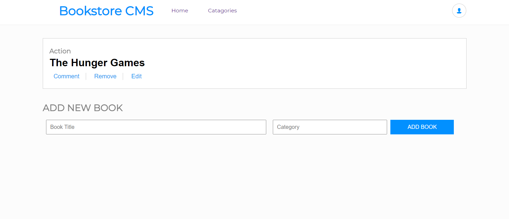

# Book Store

> This project will lay foundations for your Bookstore website. I will create a React and Redux app. I'll structure my files using the "feature folder" approach. I will also set up routing using React Router.

## Built With

- HTML, CSS, and JavaScript
- React
- Redux
- git/GitHub

## Live Demo

[Live Demo Link](https://confident-hopper-ed5187.netlify.app/)

### `Getting Started
To get a local copy up and running follow these simple example steps.

  - go to the directory that you want to clone the repository in.
  - right click and choose Git Bash here.
  - type "git clone https://github.com/Wes-Isaac/Math-Magician.git".
  - run "npm install" and then "npm start"

## Authors

👤 **Yishak**

- GitHub: [Yishak ,Wes-Isaac](https://github.com/Wes-Isaac)
- LinkedIn: [@Yishak](https://www.linkedin.com/in/yishak-wesego-b404851a7/)

## 🤝 Contributing

Contributions, issues, and feature requests are welcome!

Feel free to check the [issues page](../../issues/).

## Show your support

Give a ⭐️ if you like this project!

## Acknowledgments

- This project is built in Microverse's second module's capstone.

## 📝 License

This project is [MIT](./MIT.md) licensed.
